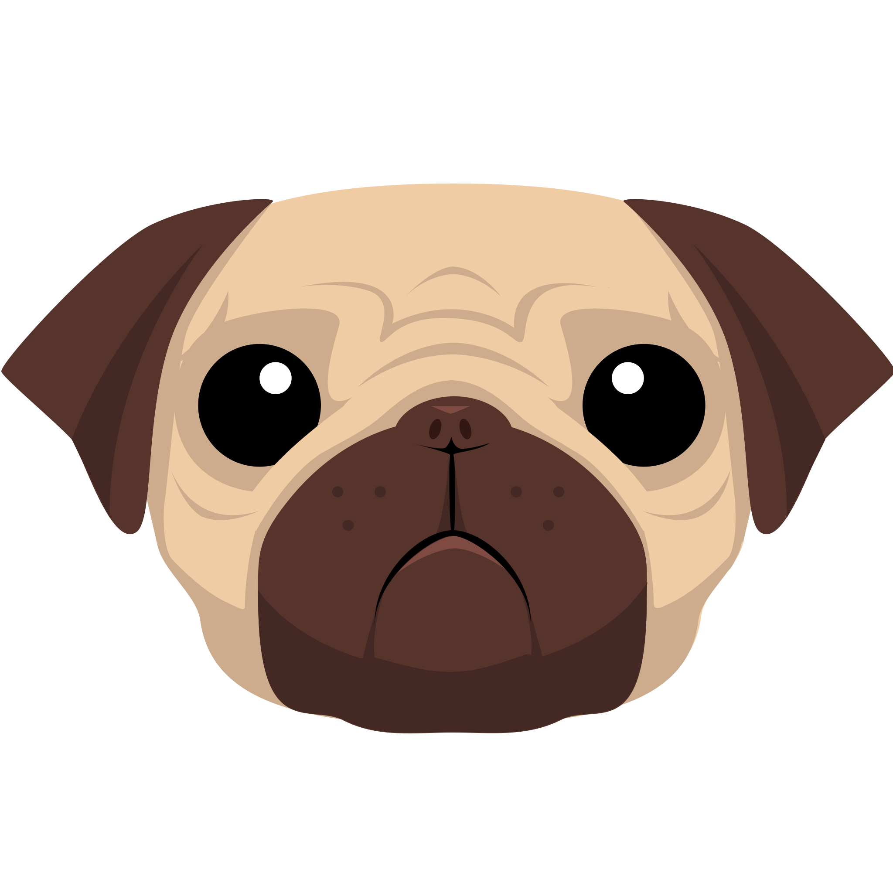
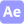

## My name is Alicia Mira Kim, and I'm a full-stack developer!

- 💬 Currently: Jobseeker! Need a full-stack dev? Contact me! :
- 💼 Work: ESL Teacher (2 years in South Korea/EPIK, 3 years remote/VIPKID, CAD/Web Contractor (2 years, OSI
- 🌱 Learning next: TypeScript, Jest, NextJS, React Native, C#
- 🍎 Education: Self-taught + SWE bootcamp (app Academy, Bachelor's Degree in General Design (Towson University
- 🎨 Hobbies: Streaming code, candle-making, metals/jewelry-making, sewing, embroidery, historical and alternative fashion, video games, anime and manga, DnD, eating, sleeping... 💤

<!-- 

https://img.shields.io/static/v1?label=<LABEL>&message=<MESSAGE>&color=<COLOR> -->

### ⚙️ Technologies
**Languages:**
  
  
  
  
  
  
  
  

**Frontend:** 

**Backend:** 

**Database:** 

**Systems:** 

**Collaborative:** 

**IDEs & Tools:** 

**Design:** 

**Other:** 

<!--  -->

### 📝 Currently working on:
a. Rebuild Coven 
  1. Layout
  2. High-level styling (fonts, key colors, global rules
  3. Functionality
  4. Seeder data
  5. Portfolio+README update/Postmortem
  
b. Complete V1 of The Chronicles/NPSeed
  1. Debugging
  2. Navigation/instructions
  3. Seeder data
  5. Portfolio+README update/Postmortem
  
c. Polish Persistamp
  1. Debugging
  2. Styling touchups
  3. Drag-n-drop
  
d. General
  1. Debugging, styling, READMEs, etc.
  2. Web Design 101 Site
  3. GenieBot Site
  4. a/A Curriculum Review
  5. Learn new tech (NextJS, Native

<small>

  Attribution for:

  - [REST API Icon](https://www.visualpharm.com/free-icons/rest%20api-595b40b65ba036ed117d1778)
  - [Agile Icon](https://thenounproject.com/search/?q=agile&i=3428387)
  - [terminal by Bluetip Design from the Noun Project](https://thenounproject.com/term/terminal/334312/)
  - [kanban by Shocho from the Noun Project](https://thenounproject.com/search/?q=kanban&i=3688361)
  - [agile by SBTS from the Noun Project](https://thenounproject.com/search/?q=agile&i=3428387)
  - <a href="https://iconscout.com/icons/maya" target="_blank">Maya Logo Icon</a> by <a href="https://iconscout.com/contributors/icon-mafia">Icon Mafia</a> on <a href="https://iconscout.com">Iconscout</a>

</small>