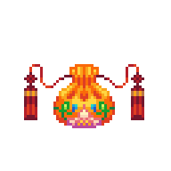

## Hello, world! It's Alicia Mira Kim!
<!-- TODO: Badges, picture, project previews/links -->

- 💬 **Currently:** Jobseeker! Need a full-stack dev? Contact me! :D
- 💼 **Work History:** CAD/Web Contractor (2yrs-OSI), ESL Teacher (3yrs-remote/VIPKid, 2yrs-South Korea/EPIK) 
- 🍎 **Education:** app Academy (SWE bootcamp), Towson University (Bachelor's Degree in General Design)
- 🎨 **Hobbies:** Streaming code, game jams, pixel art, drawing, painting, candle-making, jewelry-making, sewing, embroidery, historical/lternative fashion, video games, anime/manga, DnD, eating, sleeping... 💤
- 🌱 **Learning Next:** TypeScript, Jest, NextJS, React Native, C#

---

### &nbsp;&nbsp;Tools & Technologies

 

**Languages**
  &nbsp;&nbsp;&nbsp;&nbsp; 
  
  
  
  
  
  
  
  

**Frontend** 
  &nbsp;&nbsp;&nbsp;&nbsp; 
  
  
  
  
  
  
  
  
  
  

**Backend** 
  &nbsp;&nbsp;&nbsp;&nbsp; 
  
  
  
  
  

**Database** 
  &nbsp;&nbsp;&nbsp;&nbsp; 
  
  
  
  

**Systems** 
  &nbsp;&nbsp;&nbsp;&nbsp; 
  
  
  
  

**IDEs & Tools** 
  &nbsp;&nbsp;&nbsp;&nbsp; 
  
  
  
  
  
  
  
  
  
  
  
  
  

**Collaborative** 
  &nbsp;&nbsp;&nbsp;&nbsp; 
  
  
  
  
  
  
  

**Design** 
  &nbsp;&nbsp;&nbsp;&nbsp; 
  
  
  
  
  
  
  
  
  
  
  
  <!-- 
  
  
   -->

**Other** 
  &nbsp;&nbsp;&nbsp;&nbsp; 
  
  
  
  
  
  
  
  

<!--  -->

 

<!-- 
### Currently working on:
-----------------------------

| Rebuild Coven | Clean up Chronicles/NPSeed | Polish Persistamp | Afterwards |
|---------------|----------------------------|-------------------|------------|
| Layout        | Debugging                  | Styling touchups  | Polish     |
| High-level styling (fonts, key colors, global rules) | Navigation/instructions | Drag-n-drop | Web Design 101 Site |
| Functionality | Seeder data | Debugging, styling, READMEs, etc  | GenieBot Site
| Seeder data   | | | a/A Curriculum Review |
| Portfolio+README update/Postmortem | | | Learn new tech (NextJS, Native | 
-->

---------------------------------
<small style="font-size: 0.4rem">
 Thank you (attributions):
  
  [REST API Icon](https://www.visualpharm.com/free-icons/rest%20api-595b40b65ba036ed117d1778) | [Agile Icon](https://thenounproject.com/search/?q=agile&i=3428387) | [terminal by Bluetip Design from the Noun Project](https://thenounproject.com/term/terminal/334312/) | [kanban by Shocho from the Noun Project](https://thenounproject.com/search/?q=kanban&i=3688361) | [agile by SBTS from the Noun Project](https://thenounproject.com/search/?q=agile&i=3428387)| <a href="https://iconscout.com/icons/maya" target="_blank">Maya Logo Icon</a> by <a href="https://iconscout.com/contributors/icon-mafia">Icon Mafia</a> on <a href="https://iconscout.com">Iconscout</a>

</small>

 We can do it!!

